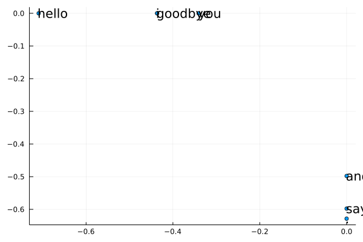

# 2章　自然言語と単語の分散表現

## 2.1 自然言語処理とは
### 2.1.1 単語の意味

## 2.2 シソーラス
### 2.2.1 WordNet
### 2.2.2 シソーラスの問題点

## 2.3 カウントベースの手法
### 2.3.1 Juliaによるコーパスの下準備

～  

```julia
julia> text = "You say goodbye and I say hello."
"You say goodbye and I say hello."
```

～  

```julia
julia> text = lowercase(text)
"you say goodbye and i say hello."

julia> text = replace(text, "." => " .")
"You say goodbye and I say hello ."

julia> words = split(text, " ")
8-element Vector{SubString{String}}:
 "You"
 "say"
 "goodbye"
 "and"
 "I"
 "say"
 "hello"
 "."
```

～  

```julia
julia> word_to_id = Dict();

julia> id_to_word = Dict();

julia> for word = words
           new_id = get!(word_to_id, word) do
               length(word_to_id) + 1
           end
           get!(id_to_word, new_id, word)
       end

```

～  

```julia
julia> word_to_id
Dict{Any, Any} with 7 entries:
  "say"     => 2
  "goodbye" => 3
  "I"       => 5
  "hello"   => 6
  "You"     => 1
  "."       => 7
  "and"     => 4

julia> id_to_word
Dict{Any, Any} with 7 entries:
  5 => "I"
  4 => "and"
  6 => "hello"
  7 => "."
  2 => "say"
  3 => "goodbye"
  1 => "You"
```

～  

```julia
julia> id_to_word[2]
"say"

julia> word_to_id["hello"]
6
```

～  

```julia
julia> corpus = [word_to_id[w] for w = words]
8-element Vector{Int64}:
 1
 2
 3
 4
 5
 2
 6
 7
```

～  

```julia
function preprocess(text)
    text = lowercase(text)
    text = replace(text, "." => " .")
    words = split(text, " ")

    word_to_id = Dict()
    id_to_word = Dict()
    for word = words
        new_id = get!(word_to_id, word) do
            length(word_to_id) + 1
        end
        get!(id_to_word, new_id, word)
    end
    corpus = [word_to_id[w] for w = words]

    return corpus, word_to_id, id_to_word
end
```

～  

```julia
julia> text = "You say goodbye and I say hello.";

julia> corpus, word_to_id, id_to_word = preprocess(text);
```

～  

### 2.3.2 単語の分散表現
### 2.3.3 分布仮説
### 2.3.4 共起行列

～  

```julia
include("../common/util.jl") # preprocess, create_co_matrix, cos_similarity

text = "You say goodbye and I say hello."
corpus, word_to_id, id_to_word = preprocess(text)

println(corpus) # [1, 2, 3, 4, 5, 2, 6, 7]

println(id_to_word)
# Dict{Integer, AbstractString}(5 => "i", 4 => "and", 6 => "hello", 7 => ".", 2 => "say", 3 => "goodbye", 1 => "you")
```

～  

```julia
C = Int32.(
    [0  1  0  0  0  0  0
     1  0  1  0  1  1  0
     0  1  0  1  0  0  0
     0  0  1  0  1  0  0
     0  1  0  1  0  0  0
     0  1  0  0  0  0  1
     0  0  0  0  0  1  0]
    )
```

～  

```julia
println(C[1,:]) # 単語IDが1のベクトル
# Int32[0, 1, 0, 0, 0, 0, 0]
println(C[5,:]) # 単語IDが5のベクトル
# Int32[0, 1, 0, 1, 0, 0, 0]
println(C[word_to_id["goodbye"],:]) # 「goodbye」のベクトル
# Int32[0, 1, 0, 1, 0, 0, 0]
```

～  

```julia
function create_co_matrix(corpus, vocab_size, window_size=1)
    corpus_size = length(corpus)
    co_matrix = zeros(Int32, (vocab_size, vocab_size))

    for (idx, word_id) = enumerate(corpus)
        for i = 1:window_size
            left_idx = idx - i
            right_idx = idx + i

            if left_idx >= 1
                left_word_id = corpus[left_idx]
                co_matrix[word_id, left_word_id] += 1
            end
            if right_idx < corpus_size
                right_word_id = corpus[right_idx]
                co_matrix[word_id, right_word_id] += 1
            end
        end
    end
    return co_matrix
end
```

～  

### 2.3.5 ベクトル間の類似度

～  

```julia
function cos_similarity(x, y)
    nx = x / sqrt(sum(x .^ 2))
    ny = y / sqrt(sum(y .^ 2))
    return nx * ny
end
```

～  

```julia
function cos_similarity(x, y, eps=1e-8)
    nx = x / (sqrt(sum(x .^ 2)) + eps)
    ny = y / (sqrt(sum(y .^ 2)) + eps)
    return nx * ny
end
```

～  

```julia
include("../common/util.jl") # preprocess, create_co_matrix, cos_similarity

text = "You say goodbye and I say hello."
corpus, word_to_id, id_to_word = preprocess(text)
vocab_size = length(word_to_id)
C = create_co_matrix(corpus, vocab_size)

c0 = C[word_to_id["you"],:]  #「you」の単語ベクトル
c1 = C[word_to_id["i"],:]  #「i」の単語ベクトル
print(cos_similarity(c0, c1))
# 0.7071067691154799
```

～  

### 2.3.6 類似単語のランキング表示

～  

```julia
function most_similar(query, word_to_id, id_to_word, word_matrix, top=5)
    if !(query in word_to_id)
        error("$query is not found")
        return
    end

    println("\n[query] $query")
    query_id = word_to_id[query]
    query_vec = word_matrix[query_id]

    vocab_size = length(id_to_word)

    similarity = zeros(vocab_size)
    for i = 1:vocab_size
        similarity[i] = cos_similarity(word_matrix[i], query_vec)
    end

    count = 0
    for i = sortperm(-similarity)
        if id_to_word[i] == query
            continue
        end
        println(" $(id_to_word[i]): $(similarity[i])")

        count += 1
        if count >= top
            return
        end
    end
end
```

～  

```julia
julia> x = [100, -20, 2]
3-element Vector{Int64}:
 100
 -20
   2

julia> sortperm(x)
3-element Vector{Int64}:
 2
 3
 1

 julia> -x
3-element Vector{Int64}:
 -100
   20
   -2
```

～  

```julia
include("../common/util.jl") # preprocess, create_co_matrix, most_similar

text = "You say goodbye and I say hello."
corpus, word_to_id, id_to_word = preprocess(text)
vocab_size = length(word_to_id)
C = create_co_matrix(corpus, vocab_size)

most_similar("you", word_to_id, id_to_word, C, top=5)
```

～  

```julia
[query] you
 goodbye: 0.7071067691154799
 i: 0.7071067691154799
 hello: 0.7071067691154799
 say: 0.0
 and: 0.0
```

## 2.4 カウントベースの手法の改善
### 2.4.1 相互情報量

～  

```julia
function ppmi(C; verbose=false, eps = 1e-8)
    """PPMI（正の相互情報量）の作成
    :param C: 共起行列
    :param verbose: 進行状況を出力するかどうか
    :return:
    """
    M = zeros(Float32, size(C))
    N = sum(C)
    S = sum(C, dims=1)
    total = size(C, 1) * size(C, 2)
    cnt = 0

    for i = 1:size(C, 1)
        for j = 1:size(C, 2)
            pmi = log2(C[i, j] * N / (S[j]*S[i]) + eps)
            M[i, j] = max(0, pmi)

            if verbose
                cnt += 1
                if cnt % (div(total, 100) + 1) == 0
                    println(@sprintf("%.1f%% done", 100*cnt/total))
                end
            end
        end
    end
    return M
end
```

～  

```julia
import Printf: @printf

include("../common/util.jl") # preprocess, create_co_matrix, cos_similarity, ppmi


text = "You say goodbye and I say hello."
corpus, word_to_id, id_to_word = preprocess(text)
vocab_size = length(word_to_id)
C = create_co_matrix(corpus, vocab_size)
W = ppmi(C)

Base.show(io::IO, f::Float32) = @printf(io, "%.3f", f) # 有効桁３桁で表示
println("covariance matrix")
display(C)
println("-"^50)
println("PPMI")
display(W)
```

～  

```julia
covariance matrix
7×7 Matrix{Int32}:
 0  1  0  0  0  0  0
 1  0  1  0  1  1  0
 0  1  0  1  0  0  0
 0  0  1  0  1  0  0
 0  1  0  1  0  0  0
 0  1  0  0  0  0  1
 0  0  0  0  0  1  0
--------------------------------------------------
PPMI
7×7 Matrix{Float32}:
 0.000  1.807  0.000  0.000  0.000  0.000  0.000
 1.807  0.000  0.807  0.000  0.807  0.807  0.000
 0.000  0.807  0.000  1.807  0.000  0.000  0.000
 0.000  0.000  1.807  0.000  1.807  0.000  0.000
 0.000  0.807  0.000  1.807  0.000  0.000  0.000
 0.000  0.807  0.000  0.000  0.000  0.000  2.807
 0.000  0.000  0.000  0.000  0.000  2.807  0.000
```

～  

### 2.4.2 次元削減
### 2.4.3 SVDによる次元削減

～  

```julia
import LinearAlgebra: svd

using Plots
include("../common/util.jl") # preprocess, create_co_matrix, ppmi


text = "You say goodbye and I say hello."
corpus, word_to_id, id_to_word = preprocess(text)
vocab_size = length(id_to_word)
C = create_co_matrix(corpus, vocab_size, window_size=1)
W = ppmi(C)

# SVD
U, S, V = svd(W)
```

～  

```julia
julia> println(C[1,:])
Int32[0, 1, 0, 0, 0, 0, 0]

julia> println(W[1,:])
Float32[0.0, 1.8073549, 0.0, 0.0, 0.0, 0.0, 0.0]

julia> println(U[1,:])
Float32[-0.34094888, 0.0, 0.12051608, 2.9802322f-8, 0.0, -0.932325, -2.5088411f-9]
```

～  

```julia
julia> println(U[1,1:2])
Float32[-0.34094888, 0.0]
```

～  

```julia
scatter(U[:,1], U[:,2], leg=false)
annotate!([(U[word_id, 1], U[word_id, 2], word) for (word, word_id) = word_to_id]..., annotationhalign=:left)
```

～  

  
図2-11　共起行列に対してSVDを行い、各単語を2次元のベクトルにしてグラフにプロットする（※「i」と「goodbye」と「you」が重なっている）

### 2.4.4 PTBデータセット
### 2.4.5 PTBデータセットでの評価


## 2.5 まとめ
